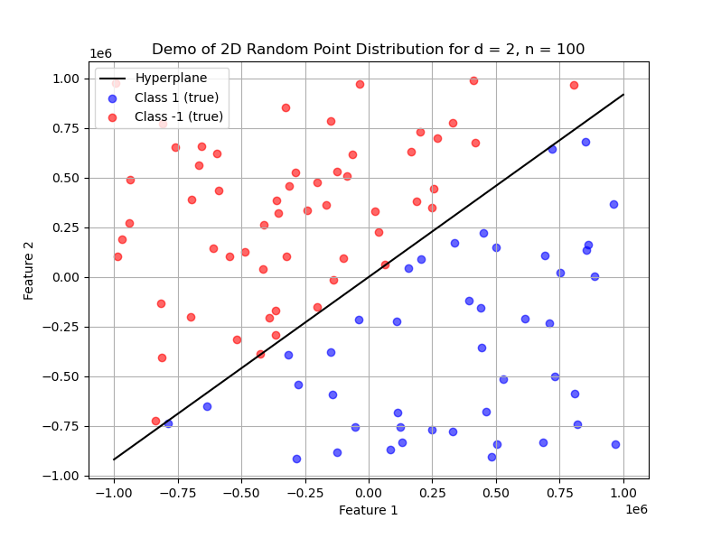
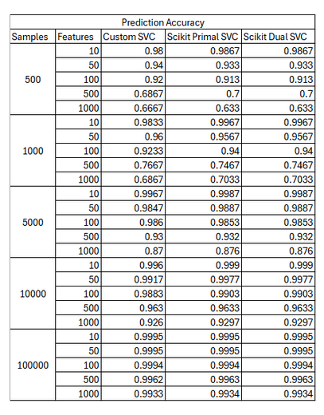
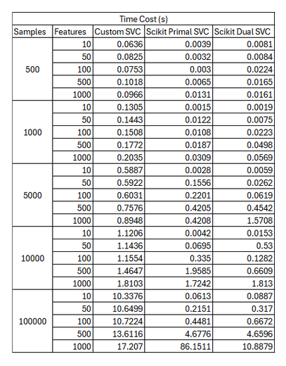

# Report: Scalability of Support Vector Machines
Dmitri Azih and Dylan Rivas

## Purposes

- Understanding the most popular Support Vector Machines (SVMs).
- Designing a basic algorithm to generate linearly separable datasets.
- Understanding and implementing the basic linear SVM with soft margin.
- Understanding and using the built-in SVMs in scikit-learn.
- Evaluating the scalability of SVMs on linearly separable datasets.

## Implementation Tasks

1. **LinearSVC Class**: 
   - Implement a Python class `LinearSVC` to learn a linear Support Vector Classifier (SVC) from a training dataset.
     - Constructor: Initializes SVC with learning rate, epochs, and random seed.
     - Training: Trains the SVC using soft-margin with hinge loss and L2-regularization.
     - Functions: Implement `net_input` for preactivation and `predict` for generating predictions.
2. **Data Generation**: 
   - Write a function `make_classification` to generate linearly separable data based on a random separation hyperplane.
     - The function should randomly generate a vector, sample points, and assign labels based on the hyperplane.
     - Split data into 70% training and 30% testing datasets.
3. **Scalability Investigation**: 
   - Investigate the scalability of the `LinearSVC` with different dataset sizes (e.g., `d = 10, 50, 100, 500, 1000` and `n = 500, 1000, 5000, 10000, 100000`).
     - Measure time cost differences for each dataset combination.
4. **Performance Comparison**: 
   - Investigate the performance of solving primal vs dual problems using scikit-learn's `LinearSVC`.
     - Compare training time and prediction accuracy on the test dataset for different dataset sizes.


## Implementation Details: Data Structures and Algorithms

In this task, we explore our implementation of a Linear Support Vector Classifier (LinearSVC).

### Training Parameters
Our LinearSVC takes four training parameters:
- **eta** (learning rate)
- **epochs** (number of training iterations)
- **random_state** (random seed for weight initialization)
- **L2_reg** (L2 Regularization parameter)

### Data Structures Used
- **Weights (w_)**: Stored as a 1D NumPy array, representing model parameters for each feature.
- **Bias (b_)**: Stored as a scalar.
- **Losses (losses_)**: Stored as a list, tracking the hinge loss value every epoch.

### LinearSVC Methods
- **`net_input(X)`**: Computes the pre-activation value, the weighted sum of inputs.
  ```
  net_input = X ⋅ w + b
  ```
  - `X` is a 1D NumPy array for a single sample or 2D/3D for multiple samples.
  - Uses vectorized computation for efficiency.

- **`fit(X, y)`**: Trains the SVC using Stochastic Gradient Descent (SGD) to minimize hinge loss.
  - **Hinge loss function with L2 regularization:**
    ```
    L = (1/n) * sum(max(0, 1 - y_i * (X_i ⋅ w + b))) + (λ/2) * ||w||²
    ```
  - Updates are made only when misclassifications occur or marginally correct predictions are made.
  - **Update rules:**
    - If `margin >= 1` (correct classification, only apply L2 regularization):
      ```
      w = w - η(λw)
      ```
    - If `margin < 1` (misclassification or within margin, update both weight and bias):
      ```
      w = w - η(λw - y_i * X_i)
      b = b - ηy_i
      ```

- **`predict(X)`**: Predicts class labels using a threshold function:
  ```
  y_prediction = 1 if f(X) >= 0 else -1
  ```
  where `f(X) = X ⋅ w + b`.

## 2. Demonstration: Linearly Separable Random 2D Point Distribution

We demonstrate our `make_classification` method, which creates a distribution of `n` random points onto a `d`-dimensional plane.

- **Parameters:**
  - `d=2` (feature space dimensionality)
  - `n=100` (number of samples)
  - `u=1e6` (width of interval of the distribution)

**Output:**
A linearly separable 2D point distribution with a hyperplane.


## 3. Performance Analysis: Time Costs and Prediction Accuracy

We evaluated our LinearSVC implementation on datasets with varying sizes and dimensions:

| Data Points (n) | Dimensions (d) | Fit Time (s) | Misclassifications | Accuracy (%) |
|----------------|---------------|-------------|---------------------|--------------|
| 500           | 10            | 0.08        | 1                   | 99.33        |
| 500           | 50            | 0.08        | 11                  | 92.67        |
| 500           | 100           | 0.08        | 15                  | 90.00        |
| 500           | 500           | 0.10        | 47                  | 68.67        |
| 500           | 1000          | 0.13        | 50                  | 66.67        |
| 1000          | 10            | 0.16        | 6                   | 98.00        |
| 1000          | 50            | 0.16        | 12                  | 96.00        |
| 1000          | 100           | 0.16        | 23                  | 92.33        |
| 1000          | 500           | 0.21        | 82                  | 72.67        |
| 1000          | 1000          | 0.26        | 88                  | 70.67        |
| 5000          | 10            | 0.80        | 8                   | 99.47        |
| 5000          | 50            | 0.80        | 31                  | 97.93        |
| 5000          | 100           | 0.83        | 22                  | 98.53        |
| 5000          | 500           | 1.02        | 96                  | 93.60        |
| 5000          | 1000          | 1.29        | 196                 | 86.93        |
| 10000         | 10            | 1.64        | 13                  | 99.57        |
| 10000         | 50            | 1.64        | 36                  | 98.80        |
| 10000         | 100           | 1.49        | 55                  | 98.17        |
| 10000         | 500           | 2.14        | 117                 | 96.10        |
| 10000         | 1000          | 3.03        | 210                 | 93.00        |
| 100000        | 10            | 15.93       | 232                 | 99.23        |
| 100000        | 50            | 15.85       | 333                 | 98.89        |
| 100000        | 100           | 16.45       | 445                 | 98.52        |
| 100000        | 500           | 20.06       | 772                 | 97.43        |
| 100000        | 1000          | 27.00       | 932                 | 96.89        |

### Key Observations
- **Larger datasets (`n`) lead to more misclassifications.** As `n` increases, classification errors increase.
- **Higher dimensionality (`d`) negatively affects accuracy.** Increasing `d` from 10 to 1000 results in lower accuracy.

## 4. Comparison: Our LinearSVC vs Scikit-Learn’s LinearSVC

We compared our custom LinearSVC with Scikit-Learn’s LinearSVC (solving both primal and dual problems) in terms of time cost and accuracy.

### Time Cost Comparison



### Accuracy Comparison
| Model | n=500 | n=1000 | n=5000 | n=10000 | n=100000 |



### Conclusion
- **Scikit-Learn’s LinearSVC (Primal) is the fastest.**
- **Scikit-Learn’s models consistently outperform our custom model in terms of efficiency.**
- **Prediction accuracy is similar across all models.**
- **Our custom model has slightly lower accuracy but performs adequately.**
---

This concludes our analysis of SVM scalability.

**[GitHub Repository](https://github.com/dcazih/scalability-of-support-vector-machines)**
